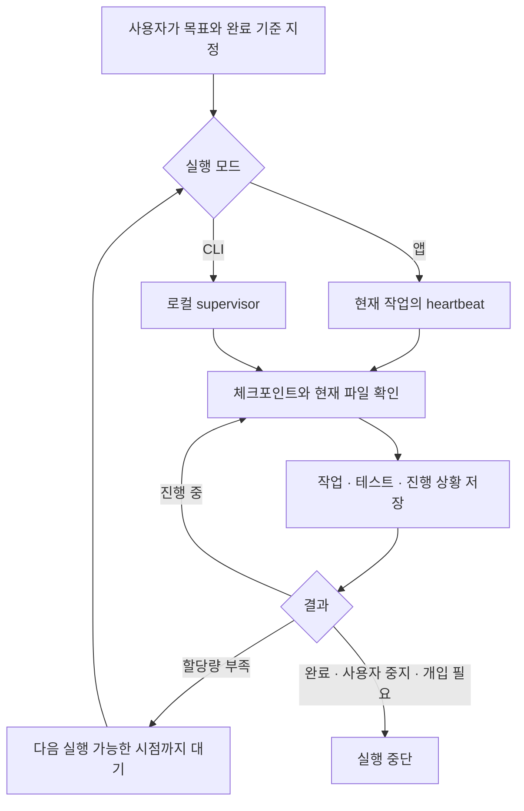

# Astra Autopilot

**Codex가 할당량 때문에 멈춰도, 저장한 프로젝트 상태를 읽고 다음 실행에서 이어서 작업하도록 돕는 도구입니다.**

앱 대화에서 시작하거나 터미널에서 직접 실행할 수 있습니다. 목표를 정하고 작업을 맡긴 뒤, 필요할 때 상태를 확인하거나 중지·재개하세요.

> OpenAI가 제공하거나 보증하는 공식 제품이 아닌 독립 오픈소스 도구입니다. 할당량을 늘리거나 제한을 우회하지 않습니다. **앱 모드는 호스트 자동화 기능에 의존**하며, **CLI 모드는 로컬 프로그램이 재시도를 관리**합니다. 완료나 정확한 충전 시각의 재개를 보장하지 않습니다.

## 어떤 모드를 쓰면 되나요?

| | Codex 앱 모드 | CLI 모드 |
|---|---|---|
| 시작 위치 | 현재 프로젝트의 앱 대화 | 터미널 또는 앱에서 CLI 작업 요청 |
| 실제 작업 위치 | 현재 앱 작업 | 별도의 `codex exec` 실행 |
| 다시 실행하는 주체 | 앱의 작업 연결 자동화(heartbeat) | 로컬 Python supervisor |
| 한도 소진 뒤 | 저장된 초기화 시각 이후 예약 실행에서 할당량 확인 후 재개 | 공식 초기화 시각 + 기본 60초 대기 후 할당량 재확인·재개 |
| 중지 | 자동화 일시정지, 실행 중에는 앱 Stop | `stop` 또는 `stop --now` |
| 조건 | 로컬 프로젝트와 heartbeat 도구 제공 환경 | Python, Git, ChatGPT 로그인된 Codex CLI |

앱 모드는 현재 대화의 맥락을 사용할 수 있습니다. CLI 모드는 앱 대화 자체를 재개하지 않으므로, 시작 전에 목표와 현재 상태를 프로젝트 파일에 정리합니다. 한 프로젝트에는 한 모드를 사용하세요. 서로 다른 프로젝트도 같은 계정의 사용량을 공유할 수 있습니다.

## 1. 한 번만 설치하기

준비물: Python 3.10 이상, Git, Codex. CLI 모드는 Codex CLI 0.153 이상과 ChatGPT 로그인이 필요합니다. 사용할 모델은 계정에서 사용 가능해야 합니다. 기본값은 `gpt-6-astra`입니다.

### 앱 플러그인만 설치

터미널에서:

```powershell
codex plugin marketplace add herohippo/astra-codex-autopilot
codex plugin add astra-autopilot@astra-autopilot-marketplace
```

**설치 후 새 Codex 작업이나 CLI 세션을 여세요.** 앱에서 바로 보이지 않으면 앱을 다시 시작하세요. 이 플러그인은 실행 스크립트를 포함하므로 플러그인 사용만을 위해 별도 Python 패키지를 설치할 필요는 없습니다.

### CLI 명령어도 설치

```powershell
git clone https://github.com/herohippo/astra-codex-autopilot.git
cd astra-codex-autopilot
python -m pip install --user .
astra-autopilot --help
```

명령어를 찾지 못하면 `python -m astra_supervisor --help`를 사용하세요. macOS/Linux의 시스템 Python에서 설치가 거부되면 가상환경 또는 `pipx install .`을 사용하세요.

Windows에서 CLI 설치와 플러그인 등록을 한 번에 하려면 저장소 폴더에서 `./scripts/install.ps1`을 실행할 수 있습니다. 설치 스크립트는 자동 개발이나 로그인 시 실행을 시작하지 않습니다.

## 2-A. Codex 앱에서 사용하기

원하는 로컬 프로젝트를 열고 다음처럼 요청하세요. 플러그인 선택 메뉴에서 **Astra Autopilot**을 선택하거나 스킬을 명시할 수 있습니다.

```text
$astra-autopilot
앱 모드로 이 프로젝트의 MVP를 완료할 때까지 이어서 작업해줘.
목표: 사용자가 할 일을 추가하고 완료 표시할 수 있는 웹앱.
완료 기준: 추가·완료·삭제 기능, 새로고침 후 저장 유지, 관련 테스트 통과.
현재 대화의 결정사항을 체크포인트에 저장하고 자동 재실행을 설정해줘.
```

이후 같은 작업에서:

```text
자동 작업 상태와 남은 일을 알려줘.
자동 작업을 일시정지해줘.
아까 멈춘 자동 작업을 다시 시작해줘.
다음 작업부터 접근성 문제 수정을 우선해줘.
```

앱 모드는 이 작업에 연결된 자동화를 사용합니다. 해당 도구가 없는 환경에서는 앱 자동 재개를 설정할 수 없습니다. 이때 CLI 모드를 선택할 수 있지만, 앱 대화를 이어가는 것과는 구분됩니다. 앱 모드는 한도 복구 직후를 감지하는 서비스가 아니며, 예약 실패가 누적되면 호스트 자동화 상태를 확인해야 합니다.

## 2-B. CLI에서 사용하기

아래 `C:\my-project`를 **실제 프로젝트 경로**로 바꾸세요. PowerShell에서는 각 명령을 한 줄로 실행합니다.

```powershell
astra-autopilot --project "C:\my-project" init --goal "할 일 앱 MVP를 구현하고 추가·완료·삭제·저장 기능의 테스트를 통과시킨다."
astra-autopilot --project "C:\my-project" doctor
astra-autopilot --project "C:\my-project" once
astra-autopilot --project "C:\my-project" start
```

- `init`: 목표와 작업 기록을 만듭니다. 새 Git 저장소가 필요하면 `--init-git`을 추가합니다.
- `doctor`: 실행 환경과 로그인을 확인합니다. 모델을 호출하지 않습니다.
- `once`: 한 차례 실행해 확인합니다. 한도 오류 후 자동 재시도하지 않습니다.
- `start`: 터미널과 분리된 백그라운드 작업을 시작합니다.
- `run`: 터미널을 열어둔 채 같은 반복 작업을 실행합니다. `start`와 동시에 실행하지 마세요.

```powershell
astra-autopilot --project "C:\my-project" status
astra-autopilot --project "C:\my-project" steer "디자인 수정 전에 데이터 저장 문제를 먼저 해결해줘."
astra-autopilot --project "C:\my-project" stop
astra-autopilot --project "C:\my-project" resume --start
```

`stop`은 현재 차례를 마친 뒤 멈춥니다. **지금 실행을 끊으려면**:

```powershell
astra-autopilot --project "C:\my-project" stop --now
```

즉시 중지해도 이미 편집한 파일은 되돌아가지 않습니다. 재개할 때 현재 파일을 확인합니다. `BLOCKED` 상태라면 원인을 해결한 뒤 `resume --blocked --start`를 사용하세요. 완료 후 새 작업을 추가하려면 목표를 수정하고 `reset-complete --yes`를 실행한 뒤 시작하세요.

앱에서 CLI 모드를 요청하는 것도 가능합니다:

```text
$astra-autopilot 이 프로젝트를 CLI 백그라운드 모드로 이어서 작업해줘.
현재 목표와 진행 상황을 저장하고 시작한 뒤 중지 방법을 알려줘.
```

## 할당량이 다시 채워진 뒤 자동 재개 (v0.3.0)

이제 할당량 소진 후 30분마다 개발 작업을 재실행하지 않습니다.

1. CLI에서 한도 오류가 발생하면 공식 Codex App Server의 `account/rateLimits/read`로 정보를 읽습니다. 모델 작업은 생성하지 않습니다.
2. 소진된 한도의 `resetsAt`에 기본 60초 여유를 더해 기다립니다. 5시간·주간 한도가 모두 소진됐으면 더 늦은 초기화 시각을 사용합니다.
3. 기다리는 시각을 프로젝트에 저장하므로 중지·재시작해도 남은 대기를 지킵니다. 기다리는 동안에도 중지할 수 있습니다.
4. 예정 시각이 되면 정보를 다시 읽고 사용 가능 상태가 확인된 경우에만 작업을 재개합니다.
5. 시각을 알 수 없거나 조회가 실패하면 개발 작업을 보류하고 기본 30분 뒤 **할당량 정보만 재조회**합니다. 이 간격은 충전 시각의 추정값이 아닙니다.

예: 14:00 한도 소진 → 공식 초기화 시각 17:20 → 17:21 이후 상태 재확인 → 사용 가능하면 재개. 실제 서비스 복구가 지연되면 계속 기다립니다.

`status`의 `quota_wait_reason`은 `reset_time`(초기화 대기), `metadata_unavailable`(정보 재조회 대기), `available`(마지막 조회에서 사용 가능)을 표시합니다. `quota_check_at`으로 마지막 조회 시각을 확인하세요. `next_retry_at`은 다음 확인 예정 시각입니다.

앱 모드도 작업 전 동일한 도우미로 확인하고 초기화 전에는 프로젝트 작업을 진행하지 않습니다. 다만 **앱 heartbeat 호출 자체를 초기화 시각까지 미루는 기능은 호스트 지원에 달려 있습니다.** 지원되는 예약 변경 기능이 있으면 저장된 자동화의 다음 실행을 조정합니다. 지원되지 않으면 기존 예약에서 도우미가 작업을 보류하므로 최대 예약 간격만큼 재개가 늦어질 수 있습니다. 앱은 할당량 소진 시 스킬 자체를 실행하지 못할 수도 있습니다. 모델 실행 없이 정확한 시각까지 기다리는 동작에는 CLI `start`를 사용하세요.

정보 조회에는 Codex CLI와 기존 ChatGPT 로그인이 필요합니다. 인증 토큰을 읽거나 비공개 웹 API를 호출하지 않습니다. [공식 App Server 인터페이스](https://developers.openai.com/codex/app-server)를 사용합니다.

## 무엇을 저장하나요?

```text
프로젝트/
└─ .autopilot/
   ├─ MASTER_TASK.md   목표·완료 기준
   ├─ STATUS.md        완료한 일·검증·다음 단계
   ├─ TASKS.md         남은 작업
   ├─ config.json     CLI 모델·대기 간격·실행 제한
   ├─ mode.json       앱 작업과 자동화 연결(앱 모드)
   └─ logs/           로컬 실행 로그
```

기존 `AGENTS.md`는 덮어쓰지 않습니다. 새로 생성하는 `.autopilot/.gitignore`는 실행 기록을 기본적으로 Git에서 제외합니다. 목표와 로그에는 프로젝트 정보가 들어갈 수 있으므로 공유 전에 확인하세요. 이미 Git에 추적된 파일은 ignore 규칙만으로 제외되지 않습니다.



## 실행 제한과 안전한 사용

CLI 설정은 `.autopilot/config.json`에 저장됩니다. `max_turns`, `max_runtime_seconds`, `turn_timeout_seconds`로 실행을 제한할 수 있습니다. 값 `0`은 해당 제한 없음이며, 실제 동작과 범위는 [운영 가이드](docs/OPERATIONS.md)를 확인하세요. 로그와 관측된 토큰 수는 계정 잔여 할당량과 다릅니다. 제공되지 않은 수치는 알 수 없음으로 표시합니다.

- ChatGPT 로그인 방식만 지원합니다. 매 실행 전에 확인하고, API 키로 자동 전환하거나 크레딧·리셋을 구매하지 않습니다. **기존 계정의 크레딧 사용 설정까지 통제하지는 않습니다.**
- 기본 sandbox는 `workspace-write`입니다. 승인이나 로그인, 중요한 결정이 필요하면 개입을 기다립니다.
- 컴퓨터가 꺼지거나 잠들면 실행할 수 없습니다. 앱 모드는 앱 스케줄러도 필요합니다. 재부팅 후 자동 시작은 기본 설치에 포함되지 않습니다.
- 완료는 에이전트가 저장된 기준을 검증한 후 표시합니다. 모든 결함이 없다는 보장은 아니므로 중요한 변경은 검토하세요.
- 앱에서 모드를 바꿀 때는 기존 자동화를 일시정지하고 진행 중 작업을 멈춘 뒤 전환하세요.

## 문서와 검증

- [운영·설정·문제 해결](docs/OPERATIONS.md)
- [대화 예시](docs/PROMPT_RECIPES.md)
- [구조와 검증 범위](docs/ARCHITECTURE.md)
- [보안 안내](SECURITY.md) · [변경 이력](CHANGELOG.md)

개발 테스트는 실제 할당량을 소진하지 않는 가짜 Codex 실행기로 진행합니다:

```powershell
python -m pip install -e . pytest
python -m pytest -q
```

공식 인터페이스 참고: [Codex 비대화형 실행](https://developers.openai.com/codex/noninteractive), [플러그인](https://developers.openai.com/codex/plugins).

MIT License. 원본 v0.1.0의 라이선스 고지를 유지합니다.

## 완료 후 예약 자동 삭제 (v0.4.0)

- 모든 완료 기준과 관련 검증을 충족하면 근거와 COMPLETE를 저장하고, 이 프로젝트에 연결된 예약만 호스트 도구로 삭제합니다.
- 실제 삭제 성공을 확인한 뒤 앱 helper `finish --automation-id ID --automation-deleted`로 연결 ID를 정리합니다. 소스·체크포인트·로그·완료 근거는 보존합니다. 이 명령 자체가 호스트 예약을 삭제하지는 않습니다.
- 삭제에 실패하거나 호스트가 삭제 기능을 제공하지 않으면 ID를 보존하고 예약을 일시정지할 수 있는 경우 정지한 뒤 사용자에게 미완료 정리를 알립니다. 삭제했다고 보고하지 않습니다.
- 사용자 중지(STOP), 진행 불가(BLOCKED)는 예약을 일시정지하고 보존합니다. 할당량 대기는 기존 초기화 시각 기반 정책을 유지합니다.
- CLI는 완료 시 프로세스가 종료되며 별도 앱 예약을 생성하지 않습니다. 다른 프로젝트의 예약은 삭제하지 않습니다.
- 완료 후 추가 개발은 새 요청으로 목표를 수정하고 완료 상태를 명시적으로 해제한 후 새 예약을 연결합니다. 단순 재개로 완료된 작업의 예약을 다시 만들지 않습니다.

업데이트 후 기존 예약에도 이 정책과 새 helper 경로를 적용해야 합니다. 플러그인 설치만으로 저장된 예약 프롬프트가 바뀌지는 않습니다.
